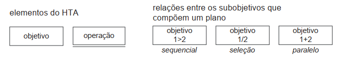
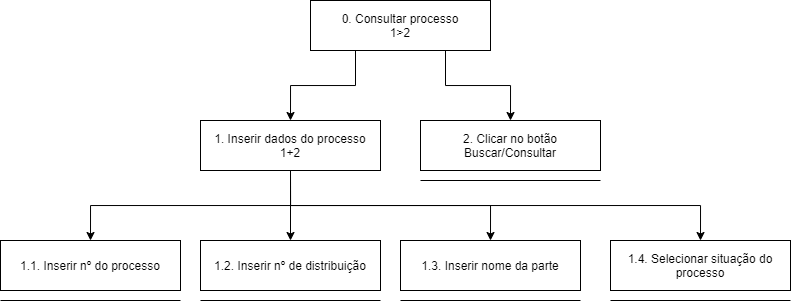
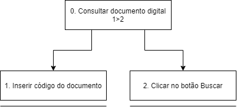
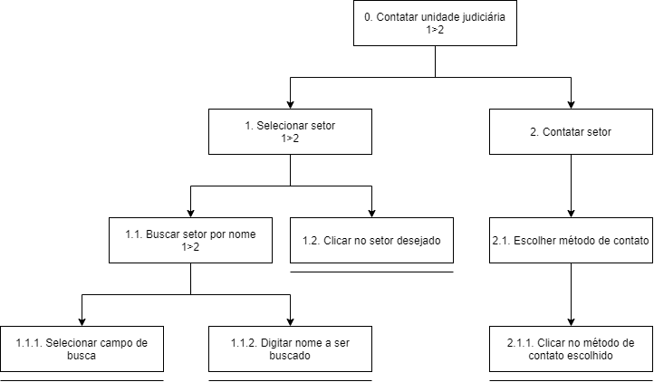

## Descrição e Objetivo

&emsp;&emsp;Uma análise de tarefas é utilizada para se ter um entendimento sobre qual é o trabalho dos usuários, como eles o realizam e por quê. Nessa análise, os objetivos dos usuários definem o trabalho a ser feito na análise. Um dos primeiros passos numa análise de tarefas é coletarmos um conjunto de objetivos das pessoas e para cada objetivo, elaborar uma lista das ações realizadas.

&emsp;&emsp;A Análise Hierárquica de Tarefas (HTA – Hierarchical Task Analysis), desenvolvida na década de 60, é utilizada para entender as competências e habilidades exibidas em tarefas complexas e não repetitivas, bem como para auxiliar na identificação de problemas de desempenho. A HTA  relaciona o que as pessoas fazem, por que o fazem, e quais as consequências caso não o façam corretamente, examinando primeiramente os objetivos de alto nível e os decompondo em subobjetivos, buscando identificar quais subobjetivos são mais difíceis de atingir, e que limitam ou impedem o alcance do objetivo maior.

&emsp;&emsp;Como o objetivo do site escolhido é fornecer informações e serviços a respeito do Tribunal de Justiça do Amapá, os 3 principais objetivos do usuário identificados foram: consultar processo a partir de número de processo, acessar documento digital e contatar unidade judiciária.

## Diagramas HTA
### Legenda

<figcaption>
Figura 01: Elementos do diagrama HTA
</figcaption>

### Tarefa 1: Consultar processo

#### Diagrama

<figcaption>
Figura 02: Consultar processo
</figcaption>

#### Tabela de Especificações
| **Objetivos / Operações** | **Problemas e Recomendações** |
| ------------------------- | ----------------------------  |
| 0. Consultar processo 1>2 | **Plano:** Visualizar informações de um processo. |
| 1. Inserir dados do processo 1+2 | **Plano:** Informar dados do processo.  **Feedback:** Aviso caso os dados sejam inválidos. |
| 1.1 Inserir n° do processo | **Input:** Número do processo. |
| 1.2 Inserir n° de distribuição | **Input:** Número de distribuição. |
| 1.3 Inserir nome da parte | **Input:** Nome da parte. |
| 1.4 Selecionar situação do processo | **Plano:** Selecionar qual a situação do processo. **Input:** Clique em uma das opções de situação. |
| 2. Clicar no botão Buscar/Consultar | **Feedback:** Redirecionamento para a página do processo. |

### Tarefa 2: Consultar documento digital

#### Diagrama

<figcaption>
Figura 03: Buscar documento digital
</figcaption>

#### Tabela de Especificações
| **Objetivos / Operações** | **Problemas e Recomendações** |
| ------------------------- | ----------------------------  |
| 0. Consultar documento digital 1>2 | **Plano:** Visualizar um documento.|
| 1. Inserir código do documento | **Input:** Código do documento.  **Feedback:** Aviso caso o código seja inválido. |
| 2. Clicar no botão Buscar | **Feedback:** Redirecionar para o documento digital. |

### Tarefa 3: Contatar unidade judiciária

#### Diagrama

<figcaption>
Figura 04: Contatar unidade judiciária
</figcaption>

#### Tabela de Especificações
| **Objetivos / Operações** | **Problemas e Recomendações** |
| ------------------------- | ----------------------------  |
| 0. Contatar unidade judiciária 1>2 | **Plano:** Contatar unidade judiciária. |
| 1. Selecionar setor 1>2 | **Recomendação:** Exibir todos os setores disponíveis quando a barra de pesquisa está vazia. |
| 1.1. Buscar setor por nome 1>2 | **Input:** Nome do setor. |
| 1.1.1. Selecionar campo de busca | |
| 1.1.2. Digitar nome a ser buscado | **Input:** Nome do setor procurado. |
| 1.2. Clicar no setor desejado | **Feedback:** Expandir a caixa do setor selecionado. |
| 2. Contatar setor | **Plano:** Contatar setor para ser atendido. |
| 2.1. Escolher método de contato | **Recomendação:** Apresentar somente os canais disponíveis para aquele setor.  **Problema:** Alguns métodos de contato redirecionam o usuário para outra página, e outros não fazem nada. |
| 2.1.1. Clicar no método de contato escolhido | **Feedback:** Redirecionar para o contato |

## Bibliografia
> Barbosa, S. D. J.; Silva, B. S. da; Silveira, M. S.; Gasparini, I.; Darin, T.; Barbosa, G. D. J.;  Interação Humano-Computador e Experiência do usuário

## Versionamento

| Versão | Data | Modificação | Autor |
| -------- |------|-------------|-------|
| 1.0 | 24/08/2021 | Criação do documento | Guilherme Vial |
| 1.1 | 25/08/2021 |  Adição de descrição | Guilherme Vial e Lucas Braun |
| 1.2 | 26/08/2021 | Adição de diagramas e tabelas | Guilherme Vial e Lucas Braun |