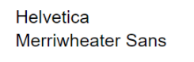
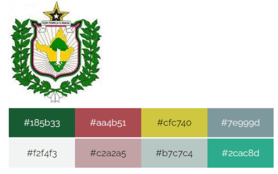
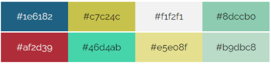
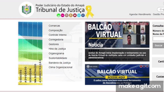
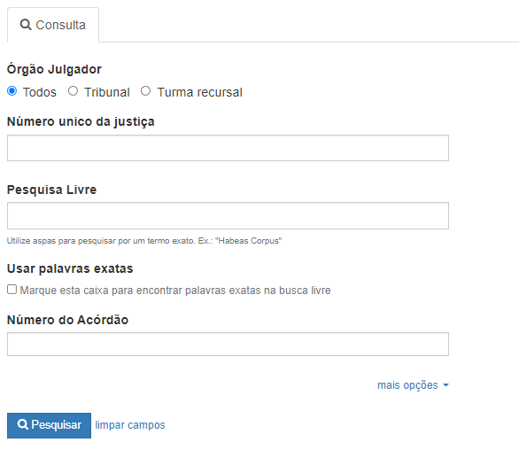

# Guia de estilos

## Introdução

### Objetivo do guia de estilo

&emsp;&emsp;Este guia de estilos tem como objetivo principal registrar as escolhas de desing feitas pelos desenvolvedores e fazer a documentação das características do site do Tribunal de Justiça do Estado do Amapá. Um guia de estilo é o que define as diretrizes para a comunicação verbal e visual de um site.

### Organização e conteúdo do guia de estilos

&emsp;&emsp;A organização do guia de estilo será definido a partir do livro Interação Humano Computador da autora Simone Barbosa e será orientado a partir do ciclo de vida Mayhew, o qual sugere que o guia de estilo tem que ser seguido ou modificado a cada nível de prototipagem.

### Público-alvo do guia de Estilos

&emsp;&emsp;O público-alvo deste guia de estilo são os próprios integrantes do grupo, que iremos nos basear para o desenvolvimentos dos protótipos.

### Como utilizar o guia

Será utilizado para guiar o grupo em decisões futuras, principalmente referentes a elaboração de protótipos.

### Como manter o guia 

O guia deve ser atualizado ao final de casa fase indicada pelo ciclo de Mayhew, para se tornar uma fonte primária de como é a estilização do sistema.

## Metodologia (bruno)

## Resultados de Análise (bruno)

## Elementos de Interface

### Janelas
Ouvidoria

### Tipografia

### Símbolos não tipográficos

### Cores

Paleta de cores da logo:

Paleta de cores predominantes no site:

### Animações

## Elementos de Interação

### Estilos de interação

&emsp;&emsp;O usuário realiza as interações com o site por meio de menus que utilizam linguagem natural, de inputs para efetuar pesquisas e inscrições e botões ou hiperlinks com elementos clicáveis.
### Seleção de um estilo

&emsp;&emsp;O estilo do site é predominantemente baseado em menus onde o usuário pode selecionar o que deseja ver e quando clica, é redirecionado para aquele local.
### Aceleradores (Teclas de atalho)

&emsp;&emsp;Não foram encontrados aceleradores no site
## Elementos de ação 

### Preenchimento de campos

&emsp;&emsp;Todos os campos de prenchimento devem ser preenchidos manualmente pelo usuário segundo as suas necessidades. Exemplo:

### Seleção

&emsp;&emsp;Não foram encontrados opções de seleção no site.

### Ativação

&emsp;&emsp;Após o preenchimento dos campos, o usuário deve clicar nos botões de ativação, que no Portal do Tribunal de Justiça do Estado do Amapá são de "Pesquisar" ou "Entrar".

## Vocabulário e Padrões (bruno)

## Bibliografia
> - BARBOSA, Simone. SILVA Bruno. "Interação Humano-Computador".
## Versionamento

| Versão | Data | Modificação | Autor |
|--|--|--|--|
| 1.0 | 01/09/2021 | Criação do documento | Enzo Gabriel e Bruno Félix |
| 1.1 | 01/09/2021 | Adição da tipografia e paleta de cores | Enzo Gabriel |
| 1.2 | 02/09/2021 | Adição da Introdução, Elementos de Interação e Elementos de ação | Enzo Gabriel |