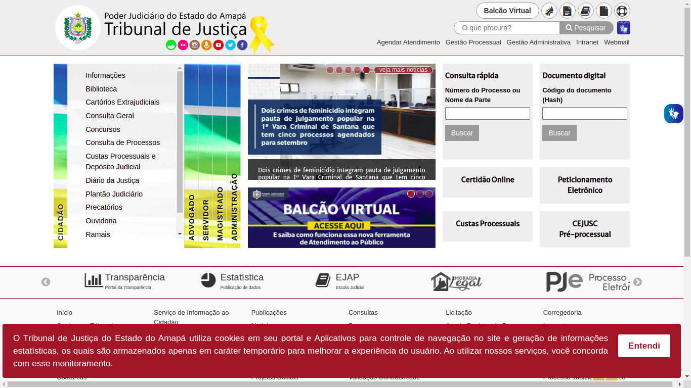
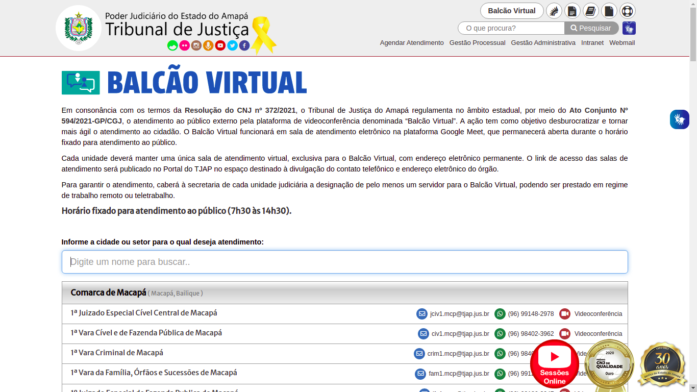
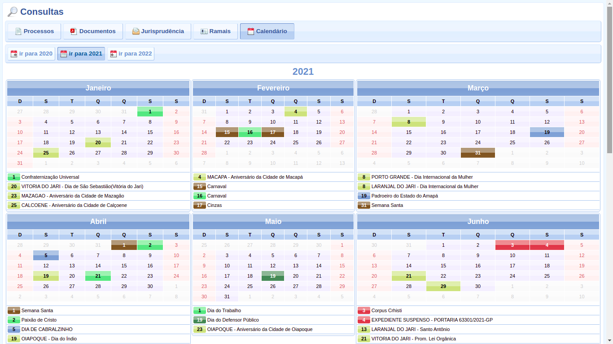
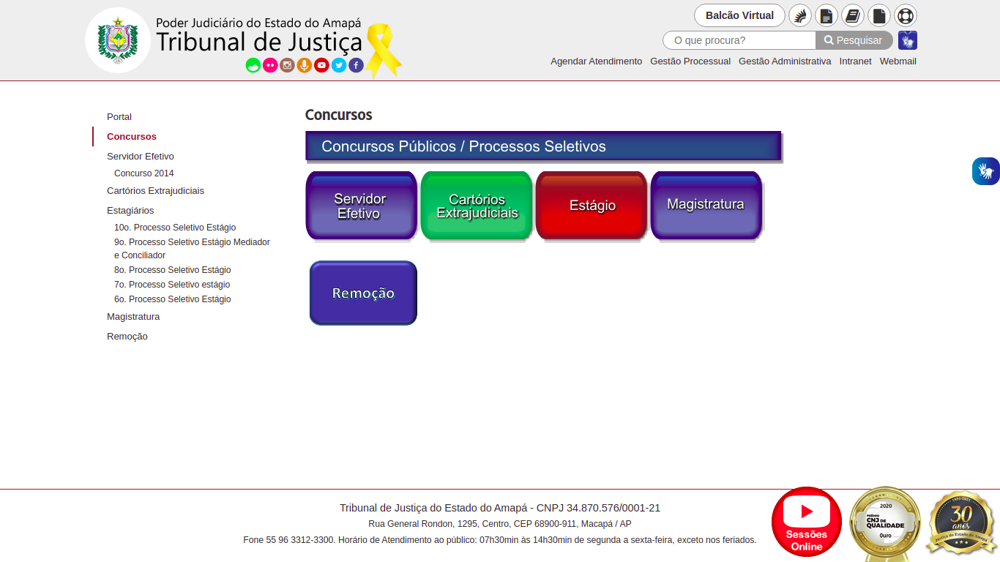
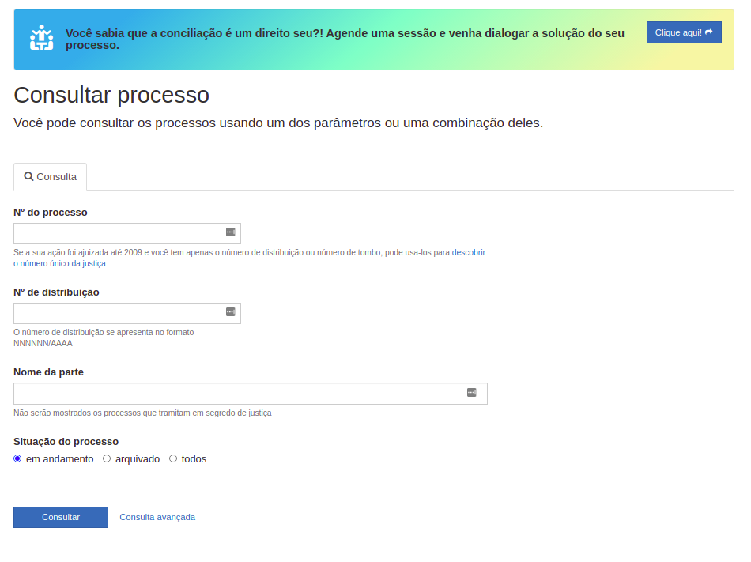
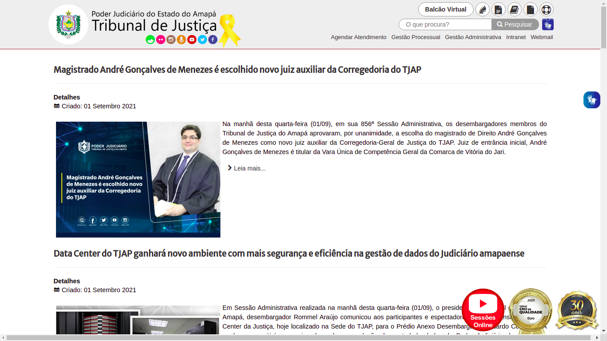
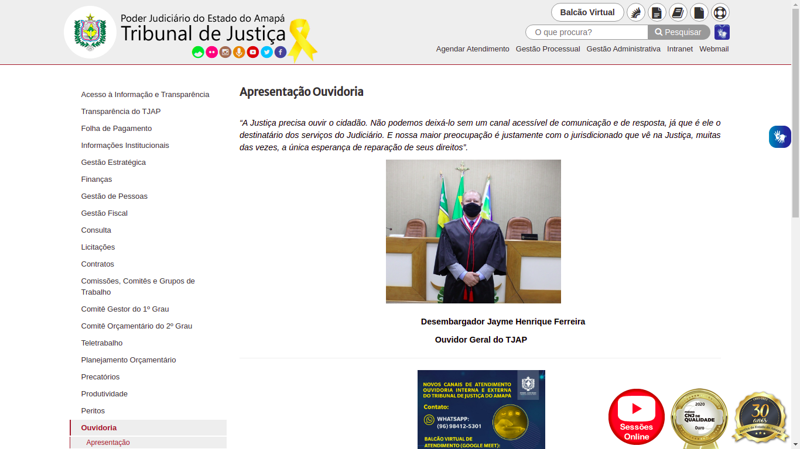
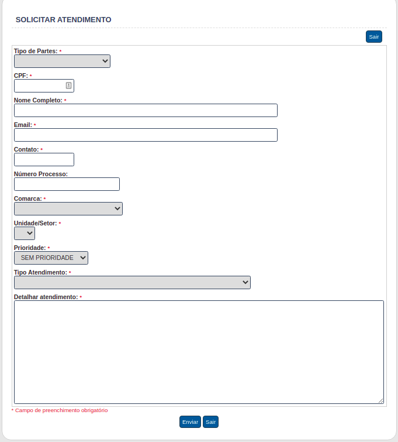
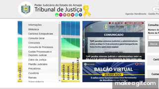
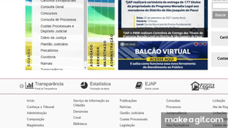

# Guia de estilos

## Objetivo

&emsp;&emsp;Este guia de estilos tem como objetivo principal registrar as escolhas de design feitas pelos desenvolvedores e fazer a documentação das características do site do Tribunal de Justiça do Estado do Amapá. Um guia de estilo é o que define as diretrizes para a comunicação verbal e visual de um site.

## Metodologia

&emsp;&emsp;Uma completa e rica construção do guia de estilo do site proporcionará uma base sólida para, futuramente, se aplicar um processo redesign na plataforma. Entender os pensamentos e decisões da equipe de design e desenvolvimento é crucial para dar mais um passo rumo a elicitação da real experiência do usuário dentro da aplicação. 

Esse guia de estilo irá seguir a seguinte estrutura (Marcus, 1991; Mayhew, 1999):

- **Introdução**: Público-alvo, Como utilizar o guia e Como manter o guia;
- **Resultados de Análise**;
- **Elementos de Interface:** Disposição espacial e grid, Janelas, Tipografia, Sı́mbolos não tipográficos, Cores e Animações;
- **Elementos de Interação:** Janelas, Tipografia, Sı́mbolos não tipográficos, Cores e Animações;
- **Elementos de Ação:**: Estilos de interação, Seleção de um estilo e Ativação;
- **Vocabulário e Padrões:** Terminologia e Tipos de tela.

## Introdução

### Público-Alvo do Guia

&emsp;&emsp;O público-alvo deste guia de estilo são os próprios integrantes do grupo, que iremos nos basear para o desenvolvimentos dos protótipos.

### Como Utilizar o Guia

&emsp;&emsp;Será utilizado para guiar o grupo em decisões futuras, principalmente referentes à elaboração de protótipos.

### Como Manter o Guia 

&emsp;&emsp;O guia deve ser atualizado ao final de cada fase indicada pelo ciclo de Mayhew, para se tornar uma fonte primária de como é a estilização do sistema.

### Organização e Conteúdo do Guia

&emsp;&emsp;A organização do guia de estilo será definido a partir do livro Interação Humano Computador da autora Simone Barbosa e será orientado a partir do ciclo de vida Mayhew, o qual sugere que o guia de estilo tem que ser seguido ou modificado a cada nível de prototipagem.

## Resultados de Análise
&emsp;&emsp;Após o levantamento e análise do guia de estilo, pode se notar que a aplicação tem, como foco, a entrega de suas inúmeras tarefas que usuário logo na sua página inicial, o que é um de seus principais erros. A página Home contém praticamente todas as ações que a plataforma entrega, o que gera uma grande dificuldade de aprendizagem e memorização de achar e fazer sua tarefa desejada. Infringindo assim, diversas metas de usabilidade e característica essenciais num site.

## Elementos de Interface

### Janelas

#### Home

Figura 1: Home [Link para a imagem expandida](../assets/guia-de-estilos/Captura_home.png)

#### Balcão Virtual

Figura 2: Balcão Virtual [Link para a imagem expandida](../assets/guia-de-estilos/Captura_balcao_virtual.png)

#### Calendário

Figura 3: Calendário [Link para a imagem expandida](../assets/guia-de-estilos/Captura_calendario.png)

#### Concursos

Figura 4: Concursos [Link para a imagem expandida](../assets/guia-de-estilos/Captura_concursos.png)

#### Consultar Processos

Figura 5: Consultar Processos [Link para a imagem expandida](../assets/guia-de-estilos/Captura_consultar_processo.png)

#### Noticias

Figura 6: Noticias [Link para a imagem expandida](../assets/guia-de-estilos/Captura_noticias.png)

#### Ouvidoria

Figura 7: Ouvidoria [Link para a imagem expandida](../assets/guia-de-estilos/Captura_ouvidoria.png)

#### Solicitar Atendimento

Figura 8: Solicitar Atendimento [Link para a imagem expandida](../assets/guia-de-estilos/Captura_solicitar_atendimento.png)

### Tipografia

Figura 9: Tipografia [Link para a imagem expandida](../assets/guia-de-estilos/tipografia.png)

### Símbolos Não Tipográficos

### Cores

Paleta de cores da logo:

Figura 10: Paleta de cores da logo [Link para a imagem expandida](../assets/guia-de-estilos/paleta-de-cores-logo.png)

Paleta de cores predominantes no site:

Figura 11: Paleta de cores do site [Link para a imagem expandida](../assets/guia-de-estilos/paleta-de-cores-site.png)

### Animações

#### Menu do Usuário

Figura 12: Menu do usuário [Link para a imagem expandida](../assets/guia-de-estilos/menu.gif)

#### Notícias

Figura 13: Notícias [Link para a imagem expandida](../assets/guia-de-estilos/menu2.gif)

#### Páginas do Portal

Figura 14: Páginas do portal [Link para a imagem expandida](../assets/guia-de-estilos/menu3.gif)

## Elementos de Interação

### Estilos de Interação

&emsp;&emsp;O usuário realiza as interações com o site por meio de menus que utilizam linguagem natural, de inputs para efetuar pesquisas e inscrições e botões ou hiperlinks com elementos clicáveis.
### Seleção de um Estilo

&emsp;&emsp;O estilo do site é predominantemente baseado em menus onde o usuário pode selecionar o que deseja ver e quando clica, é redirecionado para aquele local.
### Aceleradores (Teclas de Atalho)

&emsp;&emsp;Não foram encontradas aceleradores no site

## Elementos de Ação

### Preenchimento de Campos

&emsp;&emsp;Todos os campos de preenchimento devem ser preenchidos manualmente pelo usuário segundo as suas necessidades. Exemplo:

Figura 15: Preenchimento de campos [Link para a imagem expandida](../assets/guia-de-estilos/preenchimento-de-campo.png)

### Seleção

&emsp;&emsp;Não foram encontrados opções de seleção no site.

### Ativação

&emsp;&emsp;Após o preenchimento dos campos, o usuário deve clicar nos botões de ativação, que no Portal do Tribunal de Justiça do Estado do Amapá são de "Pesquisar" ou "Entrar".

## Vocabulário e Padrões

### Terminologia
&emsp;&emsp;Por se tratar de um site jurídico, se é esperado que a linguagem utilizada seja bem verbosa e rebuscada, o que não necessariamente acontece no TJAP, a linguagem utilizada no site é simples e consideravelmente familiar. Um ponto indiretamente ligado a terminologia, mas que valida tudo isso dito, é a granularidade e diversidade na comunicação, por múltiplas plataformas, como o seu usuário, seja via o próprio site, o seu youtube, o seu podcast, atendimento por videoconferência, aba de notícias entre outros. Tanta opção e ferramenta de comunicação, trás a sociedade como um todo para próximo da plataforma, não somente a comunidade jurídica.

### Tipos de Tela
&emsp;&emsp;Observando a plataforma e todas as opções de uso do usuário, pudesse notar 3 importantes tipos de telas:

- **Home**: Onde praticamente todas as ações cruciais estão apresentadas para o usuário;
- **Páginas de Ação**: Páginas onde o usuário pode fazer ações relevantes dentro da aplicação, algumas são redirecionadas para plataformas terceiras para tais ações;
- **Páginas Institucionais**: Páginas estáticas, onde a leitura e navegabilidade é a principal ação do usuário, muito caracterizada pela entrega de informações como notícias, galeria de fotos e outras mais.

## Bibliografia
> - BARBOSA, Simone. SILVA Bruno. "Interação Humano-Computador".

## Versionamento

| Versão | Data | Modificação | Autor |
|--|--|--|--|
| 1.0 | 01/09/2021 | Criação do documento | Enzo Gabriel e Bruno Félix |
| 1.1 | 01/09/2021 | Adição da tipografia e paleta de cores | Enzo Gabriel |
| 1.2 | 02/09/2021 | Adição da Introdução, Elementos de Interação e Elementos de ação | Enzo Gabriel |
| 1.3 | 03/09/2021 | Adição da Metodologia, Resultados de Análise e Vocabulário e Padrões | Bruno Félix |
| 2.0 | 04/09/2021 | Ajustes gerais no documento | Bruno Félix |