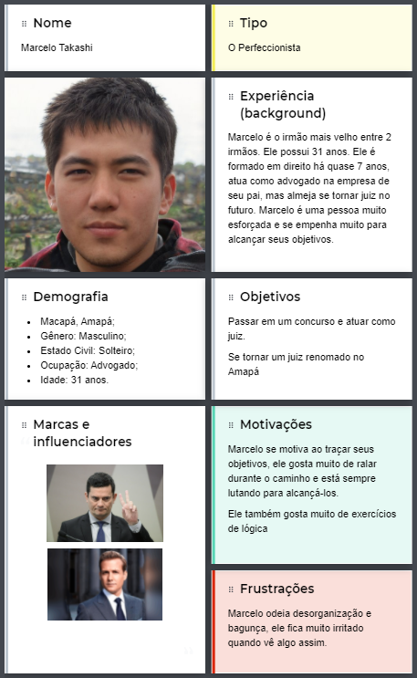
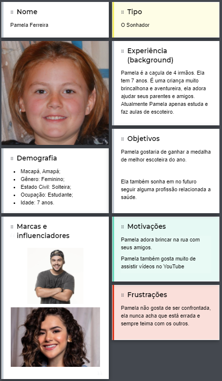

# Personas

## Introdução

&emsp;&emsp;Uma persona é um personagem fictício, arquétipo hipotético de um grupo de usuários reais, criada para descrever um usuário típico (Cooper et al., 2007; Pruitt e Adlin, 2006; Cooper, 1999). 

&emsp;&emsp;Personas são utilizadas principalmente para representar um grupo de usuários finais durante discussões de design, mantendo todos focados no mesmo alvo.

&emsp;&emsp;Vale ressaltar que para fazer as personas, utilizamos foto do site <a href="https://thispersondoesnotexist.com/">ThisPersonDoesNotExist</a>, que gera imagens de pessoas que não existem, ou seja, nenhuma das imagens infringe alguma lei.

&emsp;&emsp;Após a identificação desses grupos e de suas características predominantes, foi utilizado o site [uxpressia](https://uxpressia.com/) para inspiração ao criar os cartões de cada persona.

&emsp;&emsp;Os tipos de personalidade foram baseados no site [vittude](https://www.vittude.com/blog/eneagrama/) utilizando a técnica de eneagrama.

## Personas Primárias

### Marcelo Takashi

Figura 1: Persona primária 1: Marcelo Takashi. [Link para a imagem expandida](../assets/personas/marcelo-takashi.png)

### Fátima Soares

Figura 2: Persona primária 2: Fátima Soares. [Link para a imagem expandida](../assets/personas/fatima-soares.png)

## Antipersona

### Pamela Ferreira

Figura 3: Antipersona 1: Pamela Ferreira. [Link para a imagem expandida](../assets/personas/pamela-ferreira.png)

## Bibliografia

> - Cooper, A.; Reimann, R.; Cronin, D. About Face 3: The Essentials of Interaction Design. New York, NY: John Wiley & Sons, 2007.
>  - Courage, C. & Baxter, K. Understanding your users: a practical guide to user requirements, methods, tools, and techniques. San Francisco, CA: Morgan Kaufmann Publishers, 2005.
>  - Pruitt, J. & Adlin, T. Th e Persona Lifecycle: keeping people in mind throughout product design. San Francisco, CA: Morgan Kaufmann Publishers, 2006. 

## Versionamento

| Versão | Data | Modificação | Autor |
|--|--|--|--|
| 1.0 | 27/08/2021 | Criação do documento | Enzo Gabriel |
