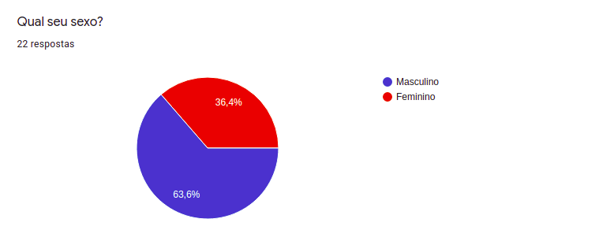
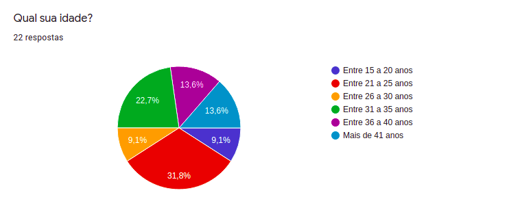
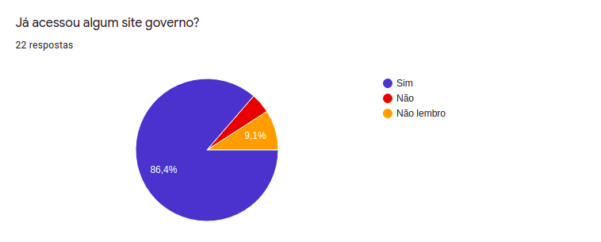
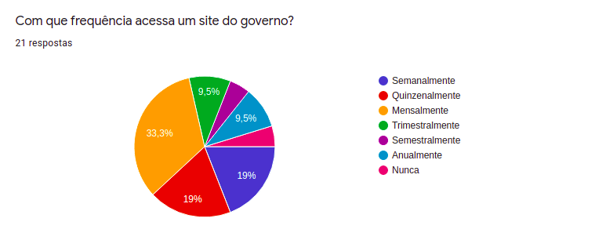
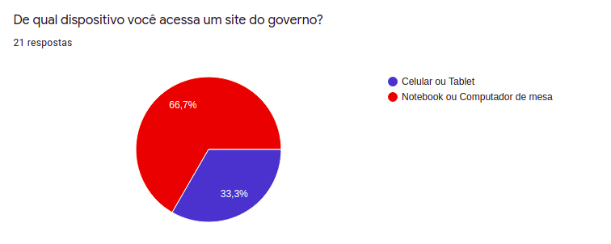
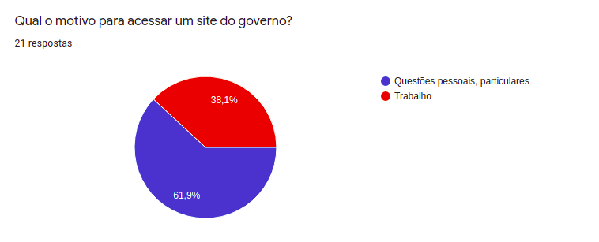
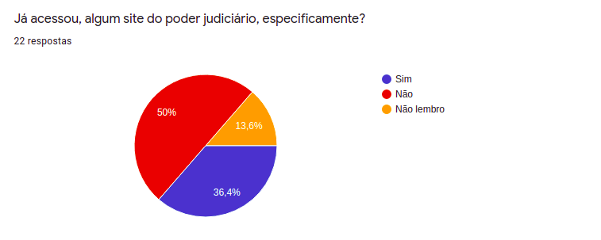
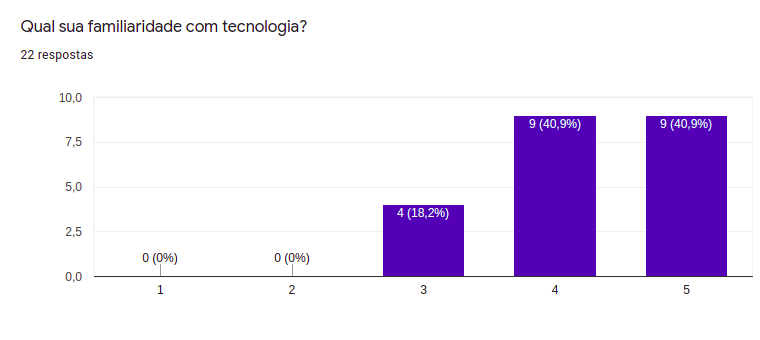
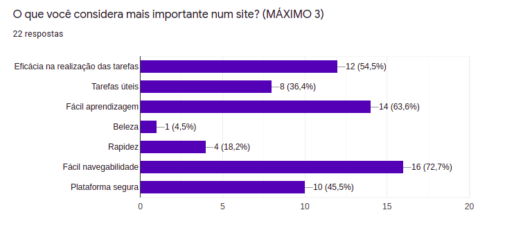

## Introdução

&emsp;&emsp;Para um estudo e análise de uma aplicação se é necessário conhecer aqueles que a usam, esse documento tem como objetivo um melhor entendimento do usuário do site. Através do uso de questionários é possível levantar dados, traçar um perfil daqueles que usam o programa e, consequentemente, fazer uma avaliação do site de forma mais direta, completa e efetiva.

### Metodologia
#### Questionário
&emsp;&emsp;Para atingir um resultado satisfatório de informações, optamos por aplicar um questionário on-line. Através dele, conseguimos atingir um grande número de pessoas em um curto espaço de tempo, assim, capturando uma interessante base de dados que constituem o perfil de usuário da aplicação.

Fizemos ao todo, 10 questões ao nosso usuário:

- Qual seu sexo?
- Qual sua idade?
- Qual seu nível de escolaridade?
- Já acessou algum site do governo?
- Com que frequência acessa um site do governo?
- De qual dispositivo você acessa um site do governo?
- Qual o motivo para acessar um site do governo?
- Já acessou algum site do poder judiciário, especificamente?
- Qual sua familiaridade com tecnologia?
- O que você considera mais importante num site?

<!-- #### Entrevista
&emsp;&emsp;Para aprofundar ainda mais no conhecimento do usuário, decidimos aplicar uma entrevista para levantar dados ainda mais completos sobre o uso da aplicação. 

Fizemos ao todo, 6 questões ao nosso usuário:

- Qual é seu tipo de usuário?
- O que te levou a acessar o site do Tribunal de Justiça do Estado do Amapá?
- Sentiu dificuldade na utilização do site?
- Você conseguiu fazer a tarefa desejada?
- Na sua opinião, o que faltou para que o site fosse melhor?
- Na sua opinião, em que característica o site poderia melhorar? -->

### Resultados

#### Questionário

Figura 1: Gráfico por sexo

Figura 2: Gráfico por faixa etária

Figura 3: Gráfico por nível de escolaridade

Figura 4: Gráfico por acesso ao site

Figura 5: Gráfico por frequencia de acesso

Figura 6: Gráfico por dispositivo de acesso

Figura 7: Gráfico por motivo de acesso

Figura 8: Gráfico por acesso a site judiciário

Figura 9: Gráfico por familiaridade com tecnologia

Figura 10: Gráfico por pontos importantes num site

---
<!-- #### Entrevista - Vinicius Matos

Entrevistador: Bruno Félix
  

- **Pergunta**: Qual é seu tipo de usuário no site?
- **Resposta**: "Estagiário".
  

- **Pergunta**: O que te levou a acessar o site do Tribunal de Justiça do Estado do Amapá?
- **Resposta**: "Analisar processos e bater o ponto diário".
  

- **Pergunta**: Sentiu dificuldade na utilização do site?
- **Resposta**: "Não".
  

- **Pergunta**: Você conseguiu fazer a tarefa desejada?
- **Resposta**: "Sim".
  

- **Pergunta**: Na sua opinião, o que faltou para que o site fosse melhor?
- **Resposta**: "Necessidade de um sistema mais rápido e que não tivesse tanta informação já quando abre o site,podem ter uma dificuldade em obter o que procura por causa de tantas informações aleatórias".
  

- **Pergunta**: Na sua opinião, em que característica o site poderia melhorar?
- **Resposta**:
    - "Rapidez";
    - "Fácil navegabilidade";
    - "Segurança da Plataforma". -->

## Conclusão 

&emsp;&emsp;Com base nos dados coletados, pode-se definir o perfil de usuário que utiliza o siteTribunal de Justiça do Estado do Amapá como adultos de diferentes idades que buscam fazer ações para resolver suas questões pessoais:

- Os usuário são, em sua maioria, do sexo **masculino**;
- A faixa etária dos usuários é bem diversificada, em sua maioria, gira em torno dos **25 aos 35 anos**;
- O nível de escolaridade dos usuário é alto, em sua grande maioria, com **ensino superior incompleto e completo**;
- O usuário acessa o site, em sua maioria, com uma frequência **mensal**;
- O usuário acessa o site, em sua maioria, via **notebook e/ou computador de mesa**;
- O usuário acessa o site, em sua maioria, por **questões pessoais e particulares**;
- O nível de familiaridade do usuário com tecnologia é diversificado, mas em média, **alto**;
- O usuário considera a **eficácia na realização das tarefas**, a **fácil aprendizagem** e a **fácil navegabilidade** como as coisas mais importantes em um site.

Todos os dados coletados pode ser encontrados [aqui](https://docs.google.com/spreadsheets/d/1kNFrln1rOJFLnRybuUHzb36R3kyGl4nU71Y_NwFx9FA/edit?usp=sharing).
## Bibliografia
> BARBOSA, Simone. SILVA Bruno. "Interação Humano-Computador"

## Versionamento
| Versão | Data | Modificação | Autor |
|--|--|--|--|
| 0.1 | 25/08/2021 | Criação do documento | Bruno Felix |
| 1.0 | 26/08/2021 | Desenvolvimento da metodologia | Bruno Felix |
| 1.1 | 27/08/2021 | Desenvolvimento dos resultados | Bruno Felix |