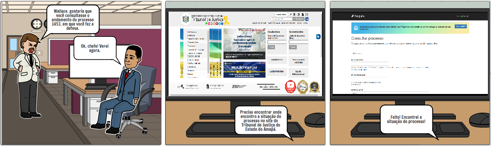
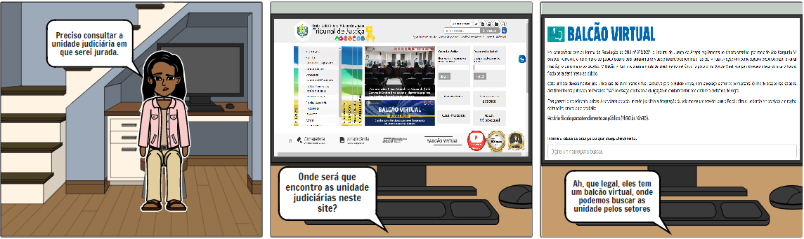
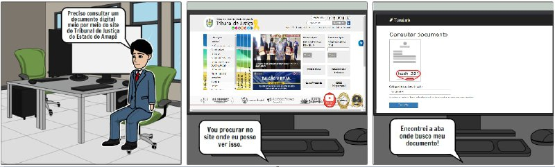

## Introdução

&emsp;&emsp;Um storyboard é uma representação gráfica que é composta de uma série de quadrinhos com ilustrações ou fotos que representam cada história, com notas sobre o que está acontecendo na cena e o que está sendo dito no roteiro durante essa foto. Pense nisso como uma espécie de versão em quadrinhos do seu roteiro.

## Objetivo
&emsp;&emsp;O Principal objetivo do desenvolvimento dos StoryBoards é auxliliar a "conceber uma solução de IHC que atenda
às metas de usabilidade estabelecidas na Análise de Requisitos"(Barbosa e Silva, 2019, p. 88).

&emsp;&emsp;Sendo assim, os StoryBoards servirá para validar o nível 1 da fase de Design, avaliação e desenvolvimento da Engenharia de usabilidade Mayhew, levantando uma visão e modelo conceitual do uso da aplicação.

## Metodologia
&emsp;&emsp;Para o desenvolvimento dos Storyboard foi consultado as [análises de tarefas](../../../../analise-de-requisitos/analise_de_tarefas/) levantadas na fase 1, Análise de Requisitos. Com o estudo das tarefas, pelo grupo, pode-se ter um prévio conhecimento das ações que o usuário faz na aplicação, com isso, foi natural aplicar os Storyboards justamente com base nas tarefas para, assim, afinar e aprimorar o entendimento da utilização da plataforma. Para o desenvolvimento dos Storyboards foi usado a plataforma [Storyboardthat](https://www.storyboardthat.com/pt).

## Storyboard 1: Consultar Processo

Figura 1: Consultar processo [Link para a imagem expandida](../../../../assets/storyboard/sb1.png)

### Preparo
 - **Definição das pessoas envolvidas:**  
[Persona Wallace Santos](../../../../analise-de-requisitos/personas/#wallace-santos)

 - **Definição do ambiente da história:**  
Escritório de Advocacia que trabalha.

 - **Definição da tarefa a ser abordada:**  
Consulta do andamento de um processo específico.

### Sequência
 - **Definição de quais passos estão envolvidos para realização da tarefa:**  
    1. Seu chefe pede para Wallace Santos consultar andamento do processo;
    2. Procura o local onde se consulta o andamento do processo;
    3. Consulta e encontra a situação do processo.

 - **Definição do que leva a pessoa a usar a aplicação:**  
Solicitação da consulta do andamento do processo.

 - **Definição da tarefa a será ilustrada:**  
Consultar o andamento de um processo específico na página [TJAP](https://www.tjap.jus.br/portal/).

### Satisfação
 - **Motivação principal da pessoa que usa a aplicação:**  
 Encontra a situação do processo procurado.

 - **Definição das realizações que a aplicação permite:**  
 Consultar o andamento e situação de um processo.

 - **Definição das necessidades que a aplicação se propõe a sanar:**  
 Consulta da situação de um processo.

## Storyboard 2: Consultar Unidade Judiciária

Storyboard 2: Consultar Unidade Judiciária [Link para a imagem expandida](../../../../assets/storyboard/sb2.png)

### Preparo
 - **Definição das pessoas envolvidas:**  
  [Persona Fátima Soares](../../../../analise-de-requisitos/personas/#fatima-soares)

 - **Definição do ambiente da história:**  
 Sua Residência.

 - **Definição da tarefa a ser abordada:**  
 Consulta de uma unidade judiciária no qual será jurada.

### Sequência
 - **Definição de quais passos estão envolvidos para realização da tarefa:**  
    1. Precisar consultar as informações da unidade judiciária no qual será jurada;
    2. Procurar o local de consulta das unidades judiciárias;
    3. Consultar e encontrar a unidade judiciária, filtrando por setores.

 - **Definição do que leva a pessoa a usar a aplicação:**  
 Necessidade de saber sobre a unidade judiciária onde será jurada.

 - **Definição da tarefa a será ilustrada:**  
 Consultar unidade judiciária no qual será jurada dentro da página [TJAP](https://www.tjap.jus.br/portal/).

### Satisfação
 - **Motivação principal da pessoa que usa a aplicação:**  
 Encontrar informações da unidade jurídica desejada.

 - **Definição das realizações que a aplicação permite:**  
 Consultar uma unidade jurídica.

 - **Definição das necessidades que a aplicação se propõe a sanar:**  
Consulta de informações de uma unidade jurídica.

## Storyboard 3: Consultar documento digital

Storyboard 3: Consultar documento digital [Link para a imagem expandida](../../../../assets/storyboard/sb3.jpeg)

### Preparo
 - **Definição das pessoas envolvidas:**  
 [Persona Marcelo Takashi](../../../../analise-de-requisitos/personas/#marcelo-takashi)

 - **Definição do ambiente da história:**  
Escritório de trabalho.

 - **Definição da tarefa a ser abordada:**  
Consulta de um documento digital específico.

### Sequência
 - **Definição de quais passos estão envolvidos para realização da tarefa:**  
    1. Precisar consultar um documento virtual;
    2. Procurar no site o local para tal ação;
    3. Encontrar e consultar o documento digital.

 - **Definição do que leva a pessoa a usar a aplicação:**  
 Necessidade de consultar um documento digital.

 - **Definição da tarefa a será ilustrada:**  
 Consultar um documento digital dentro da página [TJAP](https://www.tjap.jus.br/portal/).

### Satisfação
 - **Motivação principal da pessoa que usa a aplicação:**  
 Consultar um documento digital desejado.

 - **Definição das realizações que a aplicação permite:**  
 Consultar um documento digital.

 - **Definição das necessidades que a aplicação se propõe a sanar:**  
 Consulta de um documento digital.

## Referências
> BARBOSA, S. D. J.; SILVA, B. S. Interação Humano-Computador. 1ª edição, Rio de Janeiro: Elsevier, 2010.  
> ROGERS, Y. Et al. Design de Interação: Além da Interação Humano-Computador. 1ª edição: Bookman.

## Versionamento

| Versão | Data | Modificação | Autor |
|--|--|--|--|
| 1.0 | 12/09/2021 | Criação e Desenvolvimento do documento | Bruno Félix e Enzo Gabriel |