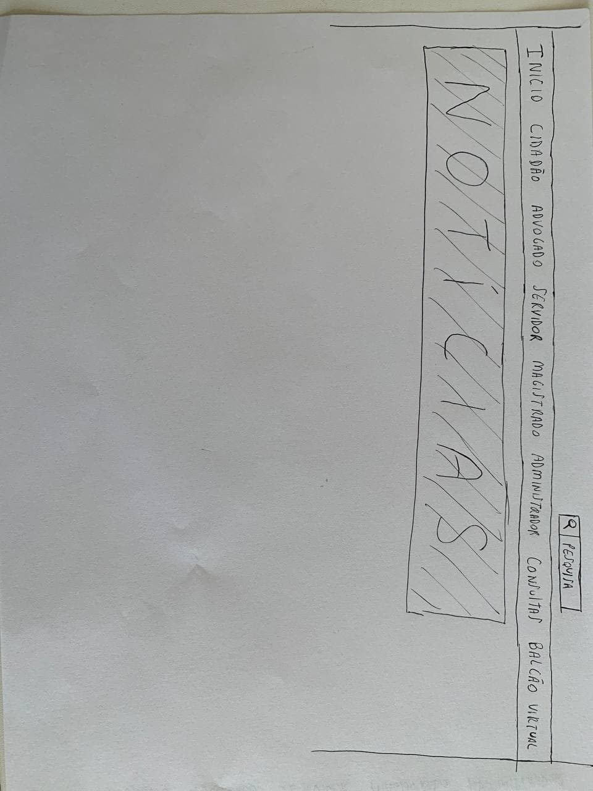
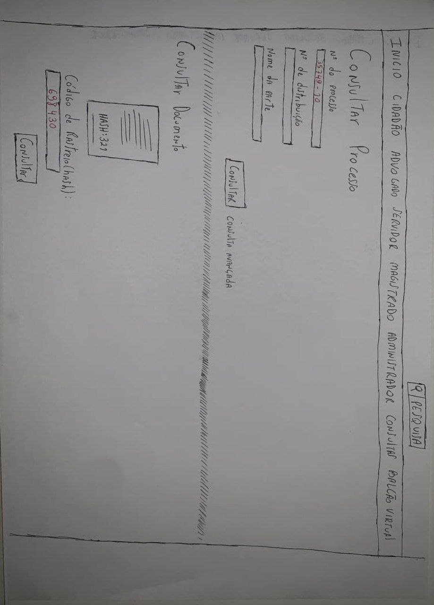
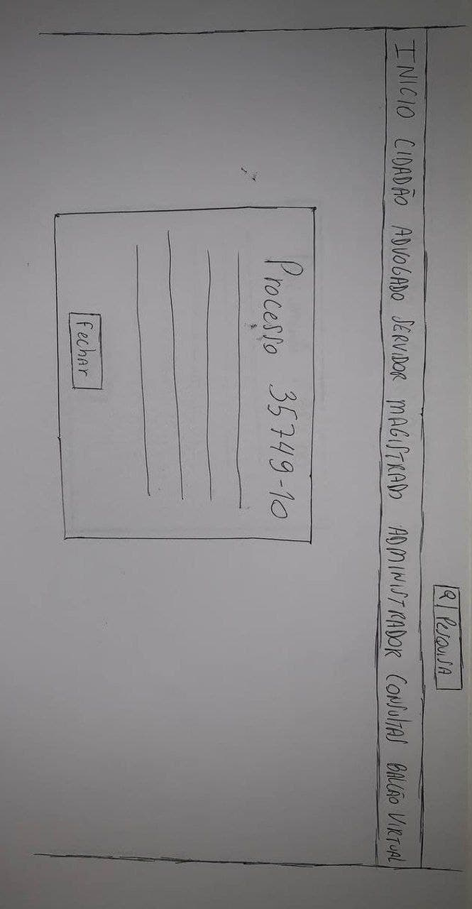
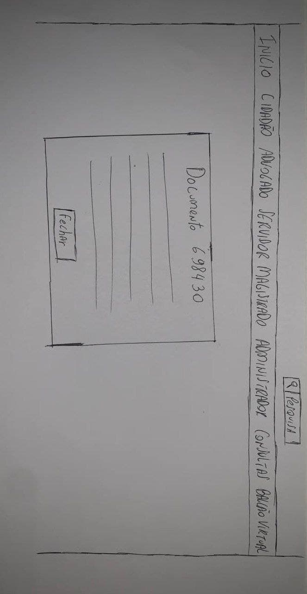
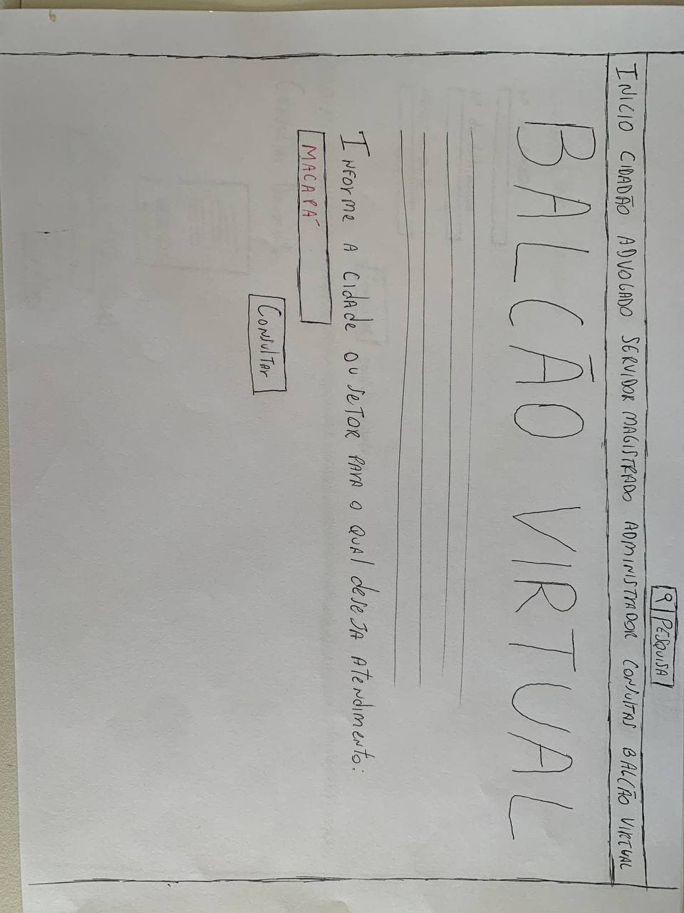
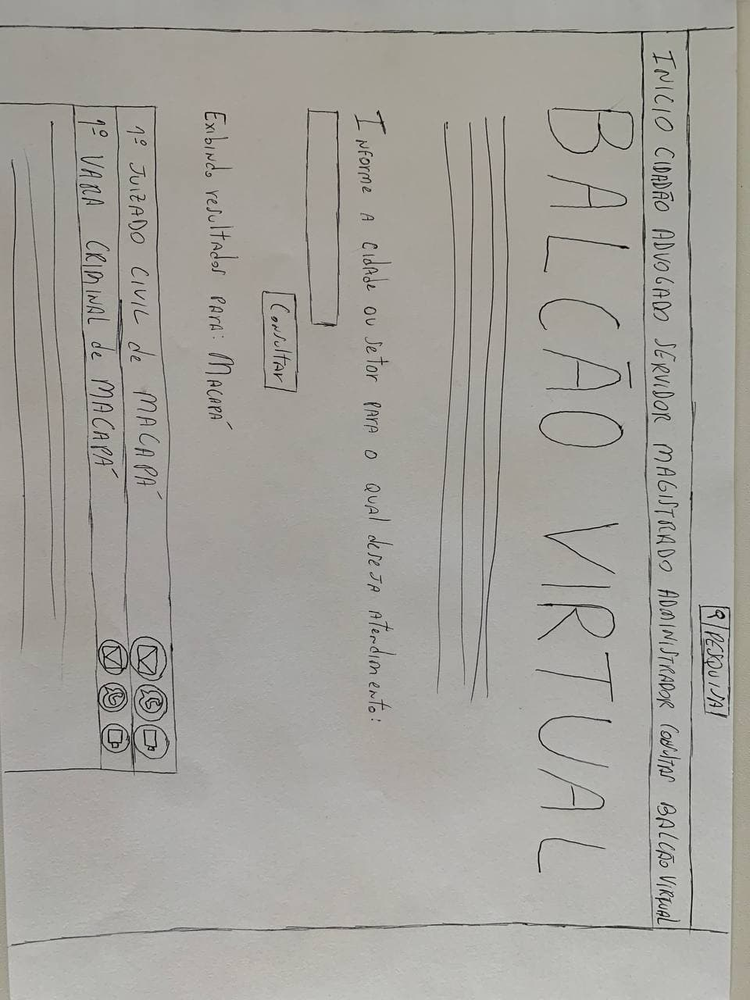

# Protótipo de Papel

## Introdução

&emsp;&emsp;A prototipagem de papel é uma técnica que permite a criação e o teste de interfaces de usuário de forma rápida e barata, onde esses protótipos funcionam muito bem para verificar o comportamento dos usuários em relação ao design da aplicação.

&emsp;&emsp;No desenvolvimentos dos protótipos de papel, a equipe se baseou nas análises de tarefas e o fluxo busca ser simples e intuitivo, com o intuito de que o sistema tenha uma boa usabilidade.

## Protótipo

&emsp;&emsp;Utilizando a plataforma MarvelApp foram feitos os links das imagens criadas nos botões que o usuário deve utilizar, buscando fazer com o que o usuário consiga utilizar o protótipo de papel seguindo os fluxos esperados.

[Link do protótipo completo](https://marvelapp.com/prototype/h3da2jh/screen/82130899)

### Tela Inicial

Figura 1: Tela Inicial [Link para a imagem expandida](../../../assets/prototipo-de-papel/tjap1.jpg)

### Tela de consultas

Figura 2: Tela de consultas [Link para a imagem expandida](../../../assets/prototipo-de-papel/tjap2.jpg)

### Consulta de processo

Figura 3: Consulta de processo [Link para a imagem expandida](../../../assets/prototipo-de-papel/tjap2_1.jpg)

### Consulta de documento

Figura 4: Consulta de processo [Link para a imagem expandida](../../../assets/prototipo-de-papel/tjap2_2.jpg)

### Tela balcão virtual

Figura 5: Tela balcão virtual [Link para a imagem expandida](../../../assets/prototipo-de-papel/tjap4.jpg)

### Tela de resultado de pesquisa no balcão virtual

Figura 6: Tela de resultado de pesquisa no balcão virtual [Link para a imagem expandida](../../../assets/prototipo-de-papel/tjap5.jpg)

## Bibliografia

> BARBOSA, Simone. SILVA Bruno. "Interação Humano-Computador"

## Versionamento

| Versão | Data | Modificação | Autor |
|--|--|--|--|
| 1.0 | 19/09/2021 | Criação do documento | Enzo Gabriel |
