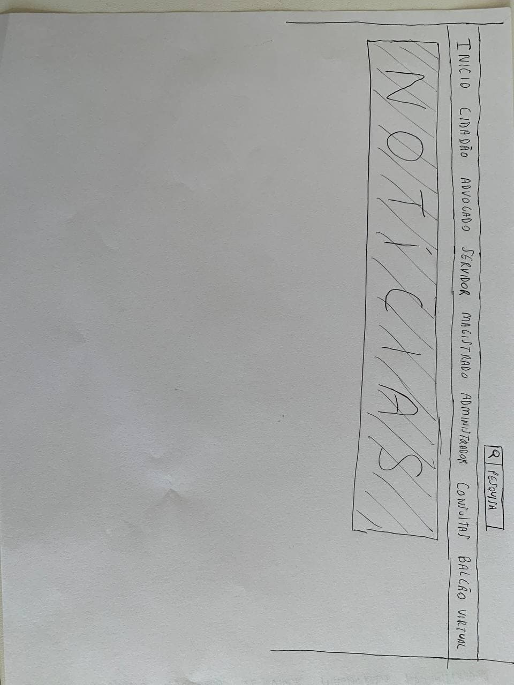

## Objetivo
&emsp;&emsp;A avaliação tem como objetivo analisar se a navegação no protótipo é intuitiva em uma simulação do uso do sistema, verificando se o usuário conseguirá cumprir suas tarefas de forma eficaz.

## Metodologia

&emsp;&emsp;O método utilizado na avaliação do protótipo de papel será a avaliação por inspeção semiótica, fundamentado na engenharia semiótica. O método de inspeção semiótica avalia a comunicabilidade de uma solução de IHC por meio de inspeção. O objetivo da inspeção semiótica é avaliar a qualidade de emissão da metacomunicação do designer codificada na interface. Portanto, não é necessário envolver usuários nessa avaliação.

## Preparação
### Cenários de interação

&emsp;&emsp;Os cenários de interação são ferramentas importantes para definir um contexto de uso e seus objetivos que os usuários desejam alcançar utilizando o sistema. Essas informações fornecem ao avaliador melhores condições para identificar, interpretar e analisar os signos codificados na interface.

Cenários utilizados:  

- Marcelo Takashi deseja passar em um concurso para se tornar juiz no Amapá. Marcelo gostaria de consultar um processo através do site.
- Fátima Soares foi sorteada para ser jurada em um processo no Tribunal de Justiça do Amapá, e gostaria de obter mais informações através do Balcão Virtual do site.

## Coleta de Dados

&emsp;&emsp;A avaliação do protótipo de baixa fidelidade foi realizada por dois avaliadores, integrantes do grupo.

As possíveis reconstruções da metamensagem do designer são apresentadas a seguir (entre colchetes estão as evidências que apoiam a afirmação):

&emsp;&emsp;**Metalinguístico:**
Eu acredito que você possui pelo menos uma das três formas de contato disponibilizadas [presença de 3 opções de contato]. Para identificar a unidade desejada, você precisa saber apenas o nome e as formas de contato da unidade jurídica [cada setor apresenta apenas nome e métodos de contato].

&emsp;&emsp;**Signos estáticos:**
Eu acredito que você deseja especificar o município em que se encontra as unidades jurídicas [barra de pesquisa para cidade ou setor].

&emsp;&emsp;**Signos dinâmicos:**

<figcaption>Figura 02: Tela inicial</figcaption>

<figcaption>Figura 03: Tela do balcão virtual</figcaption>

<figcaption>Figura 04: Tela do resultado de pesquisa</figcaption>

&emsp;&emsp;Com base nessa sequência, é possível reconstruir um trecho da metamensagem do designer como a seguir:

## Interpretação e consolidação dos resultados
## Relato dos resultados

## Bibliografia
> BARBOSA, Simone. SILVA Bruno. "Interação Humano-Computador"

## Versionamento

| Versão | Data | Modificação | Autor |
|--|--|--|--|
| 1.0 | 30/09/2021 | Criação do documento | Guilherme e Lucas |
