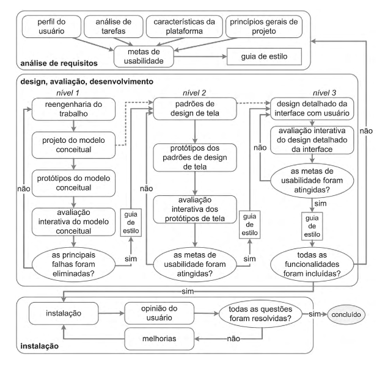

## Introdução

## Sites Avaliados

### Portal de Dados Abertos do DF
&emsp;&emsp;O Portal de Dados Abertos do DF é uma ferramenta disponibilizada pelo governo em que qualquer um pode acessar dados públicos sobre diversos temas no DF em formato bruto e aberto.

### KaBum!
&emsp;&emsp;O KaBum! é um site de comércio eletrônico focado em tecnologia e especializado em eletrônicos e hardware. É uma das plataformas de e-commerce mais utilizadas no país.

### gov.br
&emsp;&emsp;O portal gov.br é um site que reúne em um só lugar diversas informações e serviços do Poder Executivo Federal.

### SIGAA
&emsp;&emsp;O SIGAA, ou Sistema Integrado de Gestão de Atividades Acadêmicas, é uma ferramenta de gerenciamento acadêmico onde discentes e docentes podem acessar diversas informações e serviços de gestão da vida acadêmica oferecidos pela UnB.

## Site escolhido: Mapa da Cultura
<figure>

<figcaption>Logo do site Mapa da Cultura</figcaption>
</figure>
&emsp;&emsp;Em reunião, o grupo decidiu que nenhum dos sites avaliados anteriormente seria boa escolha para o foco do projeto devido aos sites não terem problemas graves ou já terem sido foco de projetos da disciplina passados. Portanto, optaram por escolher juntos outro site para basear o projeto.

&emsp;&emsp;O site escolhido foi o [Mapa da Cultura](http://mapas.cultura.gov.br/), que é um espaço para dar visibilidade para projetos, artistas e eventos culturais. É a principal base de informações do Ministério da Cultura e agrega diversos programas culturais.

## Cronograma de Atividades

## Quadro de Disponibilidade

## Metodologia

## Processo de Design

&emsp;&emsp;O design é um processo que envolve as seguintes atividades básicas: a análise da situação atual, a síntese de uma intervenção e a avaliação dessa intervenção projetada ou já aplicada à situação atual. Cada processo de design detalha essas atividades básicas de uma forma particular, definindo: como executar cada atividade; a sequência em que elas devem ser executadas; quais atividades podem se repetir, e por quais motivos; e os artefatos consumidos e produzidos em cada uma delas. (Barbosa e Silva, 2010).

&emsp;&emsp;A equipe optou por seguir o processo de design Engenharia de usabilidade de Mayhew.
### Engenharia de Usabilidade de Mayhew

Figura 2: Ciclo de vida de Mayhew. Retirado de: BARBOSA, Simone. SILVA Bruno. "Interação Humano-Computador". Capítulo 4, página 110.

- **Análise de requisitos:** É onde são definidas as metas de usabilidade com base no perfil dos usuários, análise de tarefas, possibilidades e limitações da plataforma em que o sistema será executado e princípios gerais de design de IHC. As metas de usabilidades definidas são, geralmente, representadas em guias de estilo por facilitarem a sua verificação durante as fases seguintes.

- **Design, avaliação e desenvolvimento:** Essa fase propõe projetar a solução de IHC em três níveis de detalhes e tem por objetivo conceber uma solução de IHC que atenda às metas de usabilidade estabelecidas na fase anterior.

- **Instalação:** Após algum tempo de uso, o designer coleta as opiniões dos usuários, utilizando essas opiniões para a melhoria do sistema futuramente ou para apontar a necessidade de novos sistemas.
## Ferramentas

 **Ferramenta** | **Nome** | **Finalidade**
 ---------------| -------- | --------------
 | Github | Github é uma ferramenta utilizada no controle de versionamento e armazenamento dos arquivos de documentação.
 | Microsoft Teams | Plataforma para realização de reuniões em chamada de voz e vídeo.
 | Telegram | Uma das maiores ferramentas de comunicação da atualidade, proporciona ao grupo uma forma de comunicação de forma ágil e facil durante todo o projeto.
 | Visual Studio Code | Principal ferramenta de edição d textos no projto.
 | MKdocs | Gerador de site estático minimalista, será usado para criar o site contendo a documentação do projeto.
 | Planilhas Google | Utilizado para criar planilhas e tabelas.

## Bibliografia
> BARBOSA, Simone. SILVA Bruno. "Interação Humano-Computador"

## Versionamento
| Versão | Data | Modificação | Autor |
|--|--|--|--|
| 1.0 | 14/08/2021 | Criação do documento | Guilherme Vial |
| 1.1 | 14/08/2021 | Adicionando sites avaliados e site escolhido | Lucas Braun |
| 1.2 | 14/08/2021 | Adicionando bibliografia e processo de design | Enzo Gabriel |
