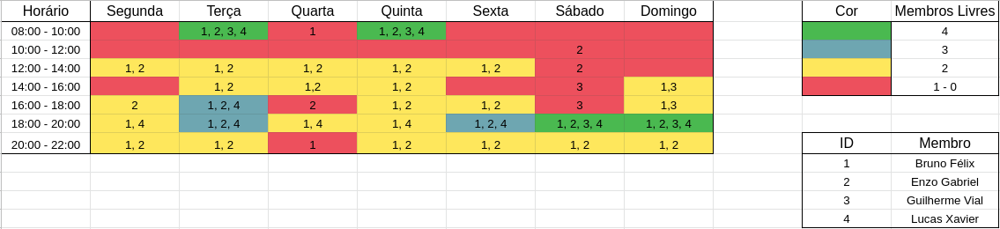

## Sites Avaliados

### Portal de Dados Abertos do DF
&emsp;&emsp;O Portal de Dados Abertos do DF é uma ferramenta disponibilizada pelo governo em que qualquer um pode acessar dados públicos sobre diversos temas no DF em formato bruto e aberto.

### KaBum!
&emsp;&emsp;O KaBum! é um site de comércio eletrônico focado em tecnologia e especializado em eletrônicos e hardware. É uma das plataformas de e-commerce mais utilizadas no país.

### gov.br
&emsp;&emsp;O portal gov.br é um site que reúne em um só lugar diversas informações e serviços do Poder Executivo Federal.

### SIGAA
&emsp;&emsp;O SIGAA, ou Sistema Integrado de Gestão de Atividades Acadêmicas, é uma ferramenta de gerenciamento acadêmico onde discentes e docentes podem acessar diversas informações e serviços de gestão da vida acadêmica oferecidos pela UnB.

## Site escolhido: Tribunal de Justiça do Estado do Amapá

    
    <figcaption>Logo do site Tribunal de Justiça do Estado do Amapá</figcaption>

&emsp;&emsp;Em reunião, o grupo decidiu que nenhum dos sites avaliados anteriormente seria boa escolha para o foco do projeto devido aos sites não terem problemas graves ou já terem sido foco de projetos da disciplina passados. Portanto, optaram por escolher juntos outro site para basear o projeto.

&emsp;&emsp;O site escolhido foi o [Tribunal de Justiça do Estado do Amapá](https://www.tjap.jus.br/portal/).

## Metodologia

### eXtreme Programming (XP)
&emsp;&emsp;A equipe decidiu por usar a metodologia, baseada nos 4 valores(comunicação, simplicidade, feedback e coragem).

### Scrum
&emsp;&emsp;A equipe decidiu optar por pontos básicos da metodologia ágio, um deles será o Scrum, dando ênfase no processo de rituais.

#### Sprints 
&emsp;&emsp;As sprints terão seus tempos de duração adaptativos, uma sprint será uma entrega e sua duração em atividade será justamente a diferença entre a entrega passada e a próxima. Nesse período todos os artefatos da entrega deverão ser desenvolvidos e finalizados.

#### Planning
&emsp;&emsp;O Planning é o ritual de discussão e planejamento de tudo que será desenvolvido durante a sprint. Neste momento o grupo observará o que tem que ser trabalhado para a próxima entrega e caso tenha alguma observação da entrega passada, corrigir lá e/ou aprimorar-la.

#### Review
&emsp;&emsp;O Review é o ritual de análise e reflexão de tudo que foi desenvolvido durante a sprint. Neste momento o grupo passa por cada tarefa feita e identifica possíveis dívidas técnicas.

### Kanban

#### Issues
&emsp;&emsp;Cada artefato/atividade desenvolvida na sprint deverá sempre ser vinculada a uma issue, assim se tem um rastreio de trabalho, panorama de andamento das atividades e visão geral do que o grupo como tem que fazer para a entrega.

- Tópicos de issue:
    - Tarefas;
    - Critério de Aceitação.

#### Zenhub
&emsp;&emsp;Usando essa ferramenta do Github, conseguimos gerenciar visualmente a produtividade do grupo através do controle em fluxos de desenvolvimento dos artefatos/ entregas.

- Etapas do Zenhub:
    - Nova issue;
    - Em Andamento;
    - Review;
    - Finalizado.

### Políticas

#### Branch e Pull Request
&emsp;&emsp;Cada artefato/ atividade deverá ser feita através de uma nova branch. Assim será possível elencar 1 ou 2 pessoas para a revisão daquela nova entrega através de um Pull Request, apontando pontos de melhorias e aprovando caso esteja bem desenvolvido.

- Padrão de Branch: <i>xx-nome_da_issue</i> (xx = número da issue)

## Processo de Design

&emsp;&emsp;O design é um processo que envolve as seguintes atividades básicas: a análise da situação atual, a síntese de uma intervenção e a avaliação dessa intervenção projetada ou já aplicada à situação atual. Cada processo de design detalha essas atividades básicas de uma forma particular, definindo: como executar cada atividade; a sequência em que elas devem ser executadas; quais atividades podem se repetir, e por quais motivos; e os artefatos consumidos e produzidos em cada uma delas. (Barbosa e Silva, 2010).

&emsp;&emsp;A equipe optou por seguir o processo de design Engenharia de usabilidade de Mayhew.
### Engenharia de Usabilidade de Mayhew

[Figura 1: Ciclo de vida de Mayhew. Retirado de: BARBOSA, Simone. SILVA Bruno. "Interação Humano-Computador". Capítulo 4, página 110.](https://user-images.githubusercontent.com/38890440/130664533-a28a915e-72e0-40dd-94f4-650f471a997c.png)

- **Análise de requisitos:** É onde são definidas as metas de usabilidade com base no perfil dos usuários, análise de tarefas, possibilidades e limitações da plataforma em que o sistema será executado e princípios gerais de design de IHC. As metas de usabilidades definidas são, geralmente, representadas em guias de estilo por facilitarem a sua verificação durante as fases seguintes.

- **Design, avaliação e desenvolvimento:** Essa fase propõe projetar a solução de IHC em três níveis de detalhes e tem por objetivo conceber uma solução de IHC que atenda às metas de usabilidade estabelecidas na fase anterior.

- **Instalação:** Após algum tempo de uso, o designer coleta as opiniões dos usuários, utilizando essas opiniões para a melhoria do sistema futuramente ou para apontar a necessidade de novos sistemas.

## Quadro de Disponibilidade

[Figura 2: Quadro de Disponibilidade do Grupo](https://user-images.githubusercontent.com/38890440/130665103-cbfca64c-2df0-4336-ae3f-7c28b2f211f0.png)

## Cronograma de Atividades

### 1ª Entrega - Planejamento do Projeto

| **Tarefas** | **Integrante(s)** | **Data Entrega** | **Revisor(es)** |
| --- | --- | --- | --- |
| Definir Equipe | Todos os integrantes | 16/08 | |
| Listas de sites avaliados e site selecionado | Lucas Xavier | 16/08 | Bruno Félix|
| Processo de Design | Enzo Gabriel | 16/08 | Guilherme Vial |
| Cronograma das atividades | Bruno Felix | 16/08 | Lucas Xavier |
| Quadro de Disponibilidade | Bruno Félix | 16/08 | Enzo Gabriel |
| Ferramentas do projeto | Guilherme Vial | 16/08 | Enzo Gabriel |

### 2ª Entrega -  Perfil do Usuário, Personas e Análise de tarefas

| **Tarefas** | **Integrante(s)** | **Data Entrega** | **Revisor(es)** |
| --- | --- | --- | --- |
| Perfil do Usuário | Bruno Felix | 28/08 | Enzo Gabriel |
| Personas | Enzo Gabriel | 28/08 | Bruno Felix |
| Análise de Tarefas | Guilherme Vial e Lucas Xavier | 28/08 | Bruno Félix e Enzo Gabriel |
| Revisão Entrega 1 | Bruno Félix e Enzo Gabriel | 28/08 | Guilherme Vial e Lucas Xavier |

### 3ª Entrega - Análise de Requisitos

| **Tarefas** | **Integrante(s)** | **Data Entrega** | **Revisor(es)** |
| --- | --- | --- | --- |
| Metas de usabilidade | Lucas Xavier | 04/09 | Bruno Félix |
| Princípios Gerais de Projeto | Guilherme Vial | 04/09 | Enzo Gabriel |
| Guia de Estilo | Bruno Félix e Enzo Gabriel | 04/09 | Guilherme Vial e Lucas Xavier |

### 4ª Entrega - Planejamento da Avaliação e do relato dos resultados: Storyboard e Análise de tarefas

| **Tarefas** | **Integrante(s)** | **Data Entrega** | **Revisor(es)** |
| --- | --- | --- | --- |
| Planejamento da Avaliação e do relato dos resultados da avaliação da Análise de tarefas | Guilherme Vial e Lucas Xavier | 13/09 | Bruno Félix e Enzo Gabriel |
| Planejamento da Avaliação e do relato dos resultados da avaliação do Storyboard | Bruno Félix e Enzo Gabriel | 13/09 | Guilherme Vial e Lucas Xavier |
| Storyboard | Bruno Félix e Enzo Gabriel | 13/09 | Guilherme Vial e Lucas Xavier |

### 5ª Entrega - Relato dos resultados | Planejamento da Avaliação e do relato dos resultados: Protótipo de Papel

| **Tarefas** | **Integrante(s)** | **Data Entrega** | **Revisor(es)** |
| --- | --- | --- | --- |
| Relato dos resultados do StoryBoard | Bruno Félix e Enzo Gabriel | 20/09 | Guilherme Vial e Lucas Xavier |
| Relato dos resultados da Análise de tarefas | Guilherme Vial e Lucas Xavier | 20/09 | Bruno Félix e Enzo Gabriel |
| Planejamento da Avaliação e do relato dos resultados da avaliação do Protótipo de Papel | Guilherme Vial e Lucas Xavier | 20/09 | Bruno Félix e Enzo Gabriel |
| Protótipo de Papel | Bruno Félix e Enzo Gabriel | 20/09 | Guilherme Vial e Lucas Xavier |

### 6ª Entrega - Relato dos resultados Planejamento 

| **Tarefas** | **Integrante(s)** | **Data Entrega** | **Revisor(es)** |
| --- | --- | --- | --- |
| Relato dos resultados do Protótipo de Papel | Guilherme Vial e Lucas Xavier | 02/10 | Bruno Félix e Enzo Gabriel |
| Planejamento da Avaliação e do relato dos resultados da avaliação do protótipo de alta fidelidade | Bruno Félix | 02/10 | Enzo Gabriel |
| Relato dos resultados da avaliação do protótipo de alta fidelidade | Enzo Gabriel | 02/10 | Lucas Xavier |
| Protótipo de alta fidelidade | Bruno Félix | 02/10 | Guilherme Vial |

### 7ª Entrega - Verificação

| **Tarefas** | **Integrante(s)** | **Data Entrega** | **Revisor(es)** |
| --- | --- | --- | --- |
| Verificação dos Artefatos | Todos os integrantes | 04/10 | |

## Ferramentas

 **Ferramenta** | **Nome** | **Finalidade**
 ---------------| -------- | --------------
 | Github | Github é uma ferramenta utilizada no controle de versionamento e armazenamento dos arquivos de documentação.
 | Microsoft Teams | Plataforma para realização e gravação de reuniões em chamada de voz e vídeo.
 | Telegram | Uma das maiores ferramentas de comunicação da atualidade, proporciona ao grupo uma forma de comunicação de forma ágil e facil durante todo o projeto.
 | Visual Studio Code | Principal ferramenta de edição de textos no projeto.
 | MKdocs | Gerador de site estático minimalista, será usado para criar o site contendo a documentação do projeto.
 | Planilhas Google | Utilizado para criar planilhas e tabelas.
 | Jitsi | Ferramenta para comunicação por voz utilizada nas reuniões do grupo.

## Bibliografia
> BARBOSA, Simone. SILVA Bruno. "Interação Humano-Computador"

## Versionamento
| Versão | Data | Modificação | Autor |
|--|--|--|--|
| 1.0 | 14/08/2021 | Criação do documento | Guilherme Vial |
| 1.1 | 14/08/2021 | Adicionando sites avaliados e site escolhido | Lucas Braun |
| 1.2 | 14/08/2021 | Adicionando bibliografia e processo de design | Enzo Gabriel |
| 1.3 | 15/08/2021 | Adicionando Cronograma de Atividades | Bruno Félix |
| 1.4 | 15/08/2021 | Adicionando Quadro de Disponibilidade e Metodologia | Bruno Félix |
| 1.5 | 24/08/2021 | Refatorando Cronograma de Atividades | Bruno Félix |
| 1.6 | 24/08/2021 | Inserindo links para figura expandida | Bruno Félix |
