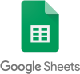

## Introdução

## Sites Avaliados

### Portal de Dados Abertos do DF
O Portal de Dados Abertos do DF é uma ferramenta disponibilizada pelo governo em que qualquer um pode acessar dados públicos sobre diversos temas no DF em formato bruto e aberto.

### KaBum!
O KaBum! é um site de comércio eletrônico focado em tecnologia e especializado em eletrônicos e hardware. É uma das plataformas de e-commerce mais utilizadas no país.

### gov.br
O portal gov.br é um site que reúne em um só lugar diversas informações e serviços do Poder Executivo Federal.

### SIGAA
O SIGAA, ou Sistema Integrado de Gestão de Atividades Acadêmicas, é uma ferramenta de gerenciamento acadêmico onde discentes e docentes podem acessar diversas informações e serviços de gestão da vida acadêmica oferecidos pela UnB.

## Site escolhido: Mapa da Cultura
<figure>

<figcaption>Logo do site Mapa da Cultura</figcaption>
</figure>
Em reunião, o grupo decidiu que nenhum dos sites avaliados anteriormente seria boa escolha para o foco do projeto devido aos sites não terem problemas graves ou já terem sido foco de projetos da disciplina passados. Portanto, optaram por escolher juntos outro site para basear o projeto.

O site escolhido foi o [Mapa da Cultura](http://mapas.cultura.gov.br/), que é um espaço para dar visibilidade para projetos, artistas e eventos culturais. É a principal base de informações do Ministério da Cultura e agrega diversos programas culturais.

## Cronograma de Atividades

## Quadro de Disponibilidade

## Metodologia

## Processo de Design

## Ferramentas

 **Ferramenta** | **Nome** | **Finalidade**
 ---------------| -------- | --------------
 | Github | Github é uma ferramenta utilizada no controle de versionamento e armazenamento dos arquivos de documentação.
 | Microsoft Teams | Plataforma para realização de reuniões em chamada de voz e vídeo.
 | Telegram | Uma das maiores ferramentas de comunicação da atualidade, proporciona ao grupo uma forma de comunicação de forma ágil e facil durante todo o projeto.
 | Visual Studio Code | Principal ferramenta de edição d textos no projto.
 | MKdocs | Gerador de site estático minimalista, será usado para criar o site contendo a documentação do projeto.
 | Planilhas Google | Utilizado para criar planilhas e tabelas.